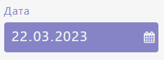
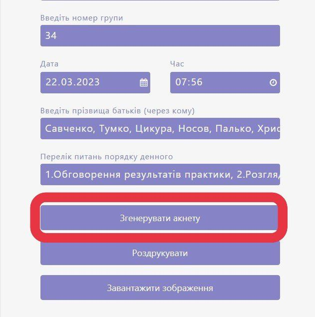
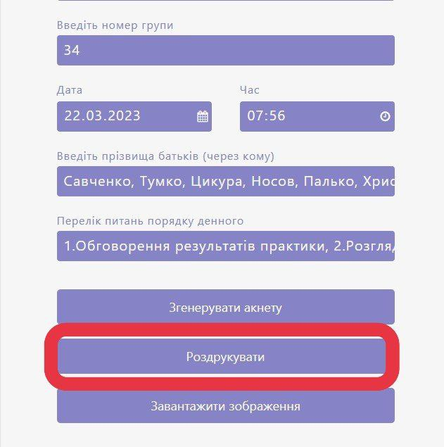
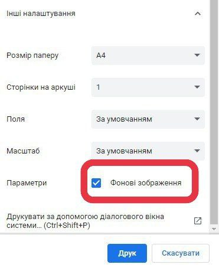
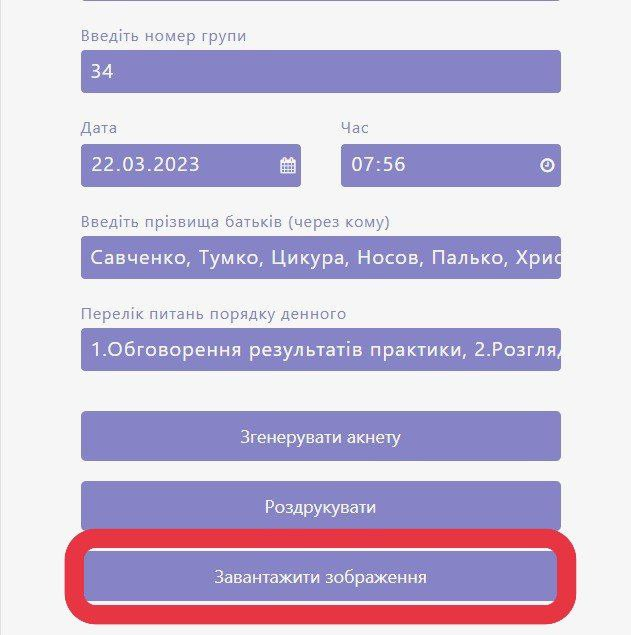

# Довідка з використання продукту
**Система для генерації запрошень на відвідання батьківськіх зборів**
Ви можете переглянути довідку за наступним посиланням, де вона була створена та де має кращий вигляд:
https://app.gitbook.com/invite/jOS29bjIHBzQybwAAQRd/42WrpodT6bPUILa8mQrK

### Заповнення анкети

1. У першому рядку необхідно ввести <mark style="color:green;">прізвище та ініціали керівника групи</mark>. Для цього наведіть курсор на відповідний рядок та натисніть ліву кнопку миші. З'явиться комірка, у яку ви можете вписати дані.

<mark style="color:purple;"></mark>.png>)_<mark style="color:purple;">Звичайний вигляд рядка</mark>_

.png>)_<mark style="color:purple;">Рядок після введення</mark>_ <mark style="color:purple;"></mark><mark style="color:purple;">даних</mark>

2. У другому рядку необхідно зазначити <mark style="color:green;">номер групи</mark>, у якій проводитимуть батьківські збори. Для цього, аналогічно попередньому пункту, наведіть курсор на рядок і натисніть ліву кнопку миші. У комірці, яка з'явилась, введіть номер групи.

.png>)_<mark style="color:purple;">Звичайний вигляд рядка</mark>_

.png>)_<mark style="color:purple;">Рядок після введення</mark>_ <mark style="color:purple;"></mark><mark style="color:purple;">даних</mark>

>_Увага! У другому рядку вводиться лише **номер** без зазначення слів "група", "номер" і т.д. Рядок приймає інформацію лише у вигляді двох цифр_

3. У третьому рядку зазначено відразу два пункти - <mark style="color:green;">дата та час.</mark>

<mark style="color:purple;">Рядок до введення даних</mark>

Обираючи дату, наведіть курсор на місце комірки та натисніть ліву кнопку миші. З'явиться невеликий календар, у якому необхідно обрати дату, яку бажаєте зазначити на запрошувальних картках.

.png>)<mark style="color:purple;">Випливаючий календар</mark>

_Ви можете **змінювати місяць**, користуючись стрілками зверху календарю. За необхідності, можна **змінити рік**, натиснувши на невеликий трикутник біля нього. **Обираючи день**, необхідно натиснути на нього, після чого випливаючий календар закриється і повна обрана дата відобразиться у комірці. Також можна скористатися кнопками **"очистити"**, що дозволить вийти з панелі введення дати, залишивши комірку порожньою, чи **"сьогодні"**, що швидко перемістить на сьогоднішню дату._

__<mark style="color:purple;">Комірка після зазначенння дати</mark>

Обираючи час, наведіть курсор на місце комірки та натисніть ліву кнопку миші. З'явиться два стовпчики із цифрами: зліва розміщені години, справа - хвилини. Аби побачити інши варіанти, прокрутіть колесо миші та натисніть на необхідні варіанти. Аби закрити редагування часу, натисніть на будь-яку іншу область сайту

.png>)<mark style="color:purple;">Комірка під час обрання часу</mark>

<mark style="color:purple;"></mark>.png>)<mark style="color:purple;">Комірка після зазначенння часу</mark>

4. Наступні два рядки - "Прізвища батьків" та "Питання порядку денного" заповніть аналогічно першому пункту. Кожне нове прізвище/пункт порядку денного пишіть після коми.&#x20;

>Ці рядки не є обов'язковими для введення, якщо ви бажаєте створити одне загальне запрошення без зазначення отримувача, чи не зазначаючи питання порядку денного зборів

<mark style="color:purple;"></mark>.png>)<mark style="color:purple;">Рядки до введення даних</mark>

<mark style="color:purple;"></mark>.png>)<mark style="color:purple;">Рядки після введення даних</mark>

### Оформлення запрошувальних карток

5. Для того, аби **додати фон** майбутніх запрошувальних карток, спочатку необхідно натиснути на значок налаштувань, розміщений у правому верхньому куті сайту

<mark style="color:purple;"></mark><mark style="color:purple;">Налаштування фону карток</mark>

<mark style="color:purple;"></mark>.png>)<mark style="color:purple;">Вікно налаштування фону карток</mark>

У правій частині сайту з'явиться вікно, у якому є можливість **обрати колір фонової картки**, чи **завантажити зображення** з вашого комп'ютера. Обраний колір/зображення можна попередньо переглянути у прямокутнику над кнопками. Також є можливість **обрати колір для тексту карток** _(третя кнопка)_

>_Вибір кольору фону або тексту здійснюється за допомогою палітри кольорів, яка відкривається після натиснення кнопки_

__.png>)_<mark style="color:purple;">Палітра кольорів</mark>_

<mark style="color:purple;"></mark>.png>)<mark style="color:purple;">Попередній перегляд фону</mark>

_Для того, аби закрити вікно налаштувань фону, повторно натисніть на кнопку у вигляді значка налаштувань_

### Перегляд та використання карток

6. Для того, аби перевірити створені картки, натисніть на першу кнопку **"Згенерувати анкету"**, розміщену відразу під рядками введення даних

__

Прогорнувши трохи нижче будуть розміщені всі картки, кількість яких залежить від кількості прізвищ батьків, зазначених у анкеті.&#x20;

_Якщо призвища не були зазначені, то буде розміщена лише одна загальна картка_

.png>)_<mark style="color:purple;">Зразок готових анкет</mark>_

>Якщо ви помітили, що якась інформація записана неправильно -  ви можете відредагувати кожну картку під час перегляду

7. Ви можете роздрукувати картки запрошень, натиснувши на другу кнопку **">"Роздрукувати"**, розміщену відразу під рядками введення даних

Після цього відкриється вікно друку

.png>)_<mark style="color:purple;">Вікно друку</mark>_

>Увага! Для того, аби під час друку відобразився обраний фон, натисніть на кнопку "Інші налаштування" та поставте галочку біля пункту "фонові зображення"



8. Для того, аби зберегти створені картки, натисніть на третю кнопку **"Завантажити зображення"**, після чого кожна картка окремо буде завантажена на ваш комп'ютер

